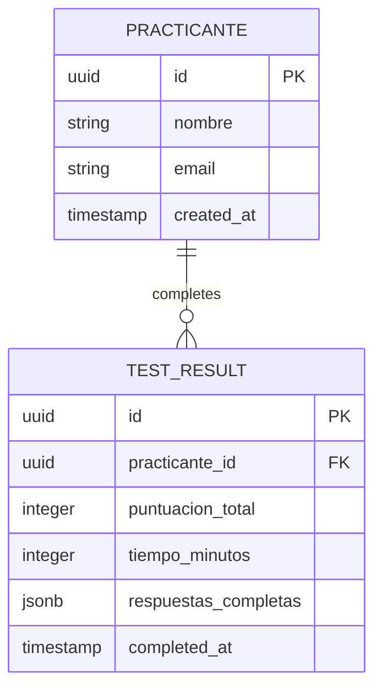

## 1. Architecture design

```mermaid
graph TD
  A[User Browser] --> B[React Frontend (Vite)]
  B --> C[Express API Server]
  C --> D[Supabase Database]
  B --> D[Supabase Client (Read-only/Auth)]
  B --> E[Local Storage]

  subgraph "Frontend Layer"
    B
  end

  subgraph "Backend Layer"
    C
  end

  subgraph "Data Layer"
    D
    E
  end
```

## 2. Technology Description

- **Frontend**: React 18 + TypeScript + Tailwind CSS
- **Build Tool**: Vite
- **Backend**: Express.js (Node.js)
- **Database**: Supabase (PostgreSQL)
- **Code Editor**: Monaco Editor (vs-code based)
- **State Management**: Zustand + Local Storage
- **Routing**: React Router DOM

## 3. Route definitions

### Frontend Routes
| Route | Purpose |
|-------|---------|
| `/` | Página de inicio con formulario de registro |
| `/test` | Interfaz principal del test con navegación por secciones |
| `/results` | Página de resultados con calificación y retroalimentación |

### API Routes (Express)
| Route | Purpose |
|-------|---------|
| `/api/submit` | Endpoint para guardar respuestas y calificar |
| `/api/results/:id` | Endpoint para obtener resultados específicos |

## 4. API definitions

### 4.1 Submit Test API
```
POST /api/submit
```

Request:
| Param Name | Param Type | isRequired | Description |
|------------|------------|-------------|-------------|
| practicante | object | true | Datos del practicante (nombre, email) |
| respuestas | object | true | Objeto con respuestas por sección |
| tiempo_total | number | true | Tiempo total en minutos |

Response:
| Param Name | Param Type | Description |
|------------|-------------|-------------|
| success | boolean | Estado de la operación |
| test_id | string | ID único del test completado |
| calificacion | object | Puntuación por sección y total |

Example:
```json
{
  "practicante": {
    "nombre": "Juan Pérez",
    "email": "juan@ejemplo.com"
  },
  "respuestas": {
    "seccion_1": {
      "pregunta_1": "b",
      "pregunta_2": "b",
      "pregunta_4": "Las interfaces definen contratos..."
    },
    "seccion_2": {
      "ejercicio_html": "<button>Click me</button>",
      "ejercicio_css": "button { background: blue; }"
    }
  },
  "tiempo_total": 45
}
```

## 5. Server architecture diagram

```mermaid
graph TD
  A[Client Request] --> B[Express Router]
  B --> C[Controller / Logic]
  C --> D[Supabase Client (Service Role)]
  D --> E[PostgreSQL Database]

  subgraph "Express Server"
    B
    C
    D
  end

  subgraph "Data Layer"
    E
  end
```

## 6. Data model

### 6.1 Data model definition


### 6.2 Data Definition Language

Tabla de Practicantes:
```sql
CREATE TABLE practicantes (
  id UUID PRIMARY KEY DEFAULT gen_random_uuid(),
  nombre VARCHAR(100) NOT NULL,
  email VARCHAR(255) UNIQUE NOT NULL,
  created_at TIMESTAMP WITH TIME ZONE DEFAULT NOW()
);

-- Índices para búsquedas rápidas
CREATE INDEX idx_practicantes_email ON practicantes(email);
CREATE INDEX idx_practicantes_created_at ON practicantes(created_at DESC);
```

Tabla de Resultados:
```sql
CREATE TABLE test_results (
  id UUID PRIMARY KEY DEFAULT gen_random_uuid(),
  practicante_id UUID REFERENCES practicantes(id),
  puntuacion_total INTEGER NOT NULL CHECK (puntuacion_total >= 0 AND puntuacion_total <= 100),
  tiempo_minutos INTEGER NOT NULL,
  respuestas_completas JSONB NOT NULL,
  completed_at TIMESTAMP WITH TIME ZONE DEFAULT NOW()
);

-- Índices para consultas frecuentes
CREATE INDEX idx_test_results_practicante ON test_results(practicante_id);
CREATE INDEX idx_test_results_completed ON test_results(completed_at DESC);
CREATE INDEX idx_test_results_puntuacion ON test_results(puntuacion_total DESC);

-- Permisos básicos
ALTER TABLE practicantes ENABLE ROW LEVEL SECURITY;
ALTER TABLE test_results ENABLE ROW LEVEL SECURITY;

GRANT SELECT, INSERT ON practicantes TO anon;
GRANT ALL PRIVILEGES ON practicantes TO authenticated;
GRANT SELECT, INSERT ON test_results TO anon;
GRANT ALL PRIVILEGES ON test_results TO authenticated;
GRANT ALL PRIVILEGES ON test_results TO service_role;
GRANT ALL PRIVILEGES ON practicantes TO service_role;
```

## 7. Componentes Principales

### 7.1 Estructura de Carpetas
```
root/
├── src/                      # Frontend (React)
│   ├── components/
│   │   ├── TestNavigation.tsx
│   │   ├── MultipleChoice.tsx
│   │   ├── CodeEditor.tsx
│   │   ├── Timer.tsx
│   │   └── ResultsSummary.tsx
│   ├── pages/
│   │   ├── Home.tsx
│   │   ├── Test.tsx
│   │   └── Results.tsx
│   ├── hooks/
│   │   └── useTestStore.ts   # Zustand Store
│   ├── lib/
│   │   └── supabase.ts
│   ├── types/
│   │   └── index.ts
│   ├── App.tsx
│   └── main.tsx
├── api/                      # Backend (Express)
│   ├── routes/
│   │   └── testRoutes.ts
│   ├── controllers/
│   │   └── testController.ts
│   ├── index.ts
│   └── supabaseAdmin.ts
├── supabase/
│   └── migrations/
└── package.json
```
