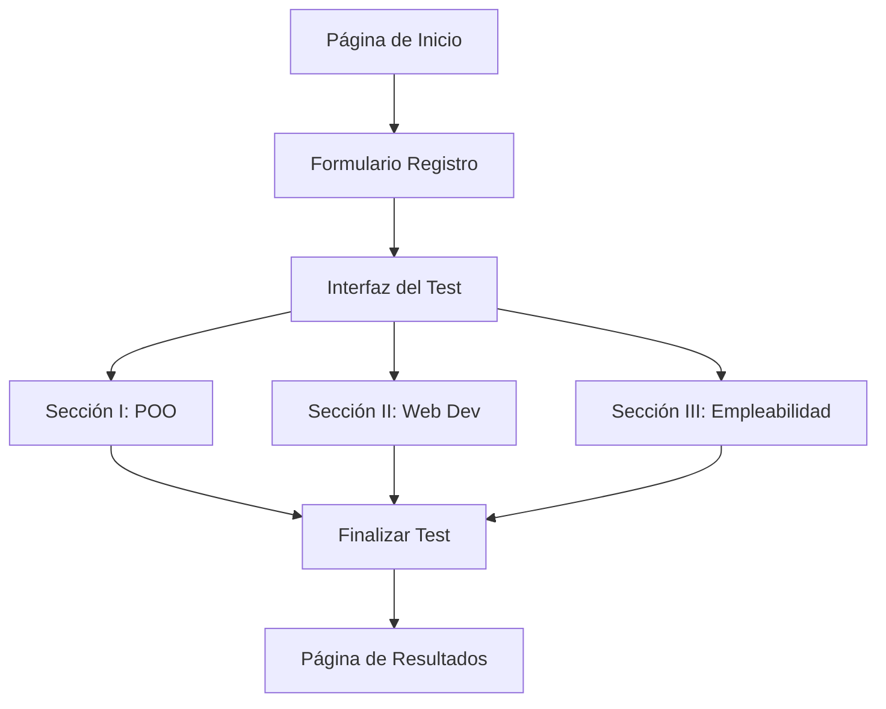

## 1. Product Overview
Sistema web para evaluar practicantes que finalizan su práctica profesional. Permite administrar y calificar automáticamente tests técnicos que abarcan programación orientada a objetos, desarrollo web y competencias de empleabilidad.

El sistema automatiza el proceso de evaluación, permite a los practicantes completar el test de forma estructurada y facilita la revisión de resultados por parte del evaluador.

## 2. Core Features

### 2.1 User Roles
| Role | Registration Method | Core Permissions |
|------|---------------------|------------------|
| Practicante | Formulario de inicio (Nombre, Email) | Completar test, ver resultados propios |
| Evaluador | Acceso directo (sin registro) | Ver todos los resultados, exportar calificaciones |

### 2.2 Feature Module
El sistema de evaluación consta de las siguientes páginas principales:
1. **Página de inicio**: Formulario de registro del practicante, información del test.
2. **Interfaz del test**: Navegación por secciones, preguntas de opción múltiple, respuestas abiertas, editor de código.
3. **Página de resultados**: Visualización de calificación, retroalimentación por sección.

### 2.3 Page Details
| Page Name | Module Name | Feature description |
|-----------|-------------|---------------------|
| Página de inicio | Formulario de registro | Capturar nombre y email del practicante, validar formato de email, iniciar test. |
| Página de inicio | Información del test | Mostrar duración total, número de secciones, temas a evaluar. |
| Interfaz del test | Navegación de secciones | Permitir cambiar entre secciones I, II y III con indicador de progreso. |
| Interfaz del test | Preguntas opción múltiple | Renderizar preguntas con radio buttons, validar respuesta única, almacenar selección. |
| Interfaz del test | Respuestas abiertas | Proveer textarea para respuestas de desarrollo, contador de caracteres mínimo. |
| Interfaz del test | Editor de código | Implementar editor con sintaxis highlighting para ejercicios prácticos de HTML/CSS/JS. |
| Interfaz del test | Control de tiempo | Mostrar temporizador descendente, alertar cuando falten 5 minutos. |
| Interfaz del test | Guardado automático | Guardar respuestas cada 30 segundos en almacenamiento local del navegador. |
| Página de resultados | Resumen de calificación | Mostrar puntuación total y por sección, porcentaje de aciertos. |
| Página de resultados | Retroalimentación | Proporcionar feedback específico por sección con sugerencias de mejora. |

## 3. Core Process
**Flujo del Practicante:**
El practicante accede al sistema, completa el formulario con sus datos personales, inicia el test y navega por las tres secciones respondiendo preguntas de diferente tipo. Al finalizar, el sistema calcula automáticamente la calificación y muestra los resultados con retroalimentación detallada.

**Flujo del Evaluador:**
El evaluador puede acceder a un panel de resultados donde visualiza todos los practicantes evaluados, sus puntuaciones por sección y puede exportar los datos para análisis posterior.

## 4. User Interface Design

### 4.1 Design Style
- **Colores primarios**: Azul profesional (#2563EB) para elementos principales
- **Colores secundarios**: Gris neutro (#6B7280) para texto secundario
- **Botones**: Estilo redondeado con hover states, color primario para acciones principales
- **Tipografía**: Inter para títulos, system-ui para contenido general
- **Tamaños de fuente**: 16px base, 24px para títulos de sección, 14px para textos pequeños
- **Layout**: Diseño centrado con ancho máximo de 768px, cards para agrupar contenido
- **Iconos**: Emoji estándar para indicadores visuales (✓, ⚠️, ⏱️)

### 4.2 Page Design Overview
| Page Name | Module Name | UI Elements |
|-----------|-------------|-------------|
| Página de inicio | Formulario de registro | Input fields con bordes redondeados, botón primario prominente, fondo blanco con sombra suave |
| Interfaz del test | Navegación de secciones | Tabs horizontales con indicadores numéricos, barra de progreso lineal superior |
| Interfaz del test | Preguntas opción múltiple | Radio buttons con labels clickeables, separación clara entre opciones |
| Interfaz del test | Editor de código | Editor Monaco con tema claro, números de línea, sintaxis coloreada |
| Página de resultados | Resumen de calificación | Cards con métricas destacadas, gráfico circular de progreso, badges de nivel |

### 4.3 Responsiveness
Diseño **desktop-first** con adaptación responsive para tablets y móviles. El test se optimiza principalmente para desktop ya que requiere escritura extensa y código. En móviles, el layout se apila verticalmente y el editor de código se expande a pantalla completa cuando se activa.